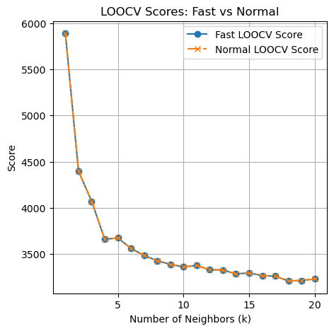

# Implementation of Fast LOOCV for KNNs

## Cross-Validation & Leave-One-Out Cross-Validation
Cross-validation is a group of methods used to check how well the results of a statistical model will work on new, unseen data. It works by splitting the data into parts and using some parts to train the model and others to test it, repeating this process several times. This technique is mainly used when the goal is to make predictions and to see how well a model might perform in real situations.

A particular method of cross-validation is leave-one-out cross-validation (LOOCV), which is a form of leave-p-out cross-validation with p = 1. In this method, one data point is left out of the training set in each iteration. The model is trained on all the other data points and then tested on the single one that was left out. This process is repeated for every data point in the dataset, so each point is used once as a test case.

LOOCV is useful because it provides a reliable estimate of how well a model will work on new data. Each model is trained on almost the entire dataset, so predictions are close to what we would get if we used all the data, and the results are consistent without being affected by random splits.

This method is especially helpful for small datasets, where using every data point for training improves accuracy. However, it can be slow for large datasets since the model has to be trained once for each data point, so it’s best used when precision is more important than speed.

## Problems with Cross-Validation for KNNs

The primary issue with applying standard cross-validation methods, and especially LOOCV, to the K-Nearest Neighbors (KNNs) algorithm is the excessive computational cost.

KNNs is a "lazy learner", meaning it does not have a traditional training phase where parameters are learned. Instead, it stores the entire training dataset. All computation, finding the $k$ nearest neighbors, occurs during the prediction phase. When performing LOOCV, this intensive prediction step is repeated for every test fold and for every value of the hyperparameter $k$ being tested.

Specifically, LOOCV is computationally taxing for KNN because, for each of the $n$ folds, the algorithm still has to calculate the distance from the single test point to all $n-1$ training points. This process scales poorly, with a complexity of approximately $O(n^2 \cdot d)$ for a single pass, where $n$ is the number of data points and $d$ is the number of features. Consequently, while cross-validation is essential for selecting the optimal value of $k$ to avoid overfitting or underfitting, the sheer computational burden often makes it impractical for large datasets.

## Results of Experiments

The paper ["Fast Computation of Leave-One-Out Cross-Validation for k-NN Regression"](https://arxiv.org/pdf/2405.04919) proposes a different method for cross-validation in k-NNs. In the following paragraphs, we will refer to this method as the $fast$ method, while the standard approach will be referred to as the $normal$ method.

### Diabetes experiment

For this experiment, we use the `Diabetes` dataset from the scikit-learn Python library.

More information about it can be found here: https://scikit-learn.org/stable/modules/generated/sklearn.datasets.load_diabetes.html

To compare the test scores of the fast vs normal methods, we took $k$ values from 1 to 20.

After running the experiments, the score comparison graph was identical to the one given in the paper. Both the fast and normal methods identified the same best k value: 18.

To analyze the computation time, we used sample sizes of `[50, 100, 150, 200, 250, 300, 350, 400]` and a constant `k = 5`.

In this experiment, the normal computation time increased exponentially, while the fast computation time remained constant. Compared to the graph in the paper, our results were minimaly different due to the machine used for testing, but the observations remain consintent with the expected results of the paper.

### Wine experiment

For this experiment, we use the `Wine` dataset from the scikit-learn Python library.

More information about it can be found here: https://scikit-learn.org/stable/modules/generated/sklearn.datasets.load_wine.html

To compare the test scores of the fast vs normal methods, we took $k$ values from 1 to 25.

After running the experiments, the score comparison graph was identical to the one given in the paper. Both the fast and normal methods identified the same best k value: 11.

To analyze the computation time, we used sample sizes of `[25, 50, 75, 100, 125, 150]` and a constant `k = 5`.

In this experiment, the normal computation time increased exponentially, while the fast computation time remained constant. Compared to the graph in the paper, our results were minimaly different due to the machine used for testing, but the observations remain consintent with the expected results of the paper.

### Tie-breaking Condition experiment

For this experiment, we reuse the datasets `Diabetes` and `Wine`, but with only one input feature, BMI and malic-acid respectively. The datasets contain duplicates, so according to the paper, the prediction between fast and normal method should fail at lower values for $k$.

After running the experiments, the score comparison graph was identical for both the `Diabetes` and the `Wine` dateset.

For the `Diabetes` dataset, $k$ value for fast method was 17, and for normal method 17, the same as in the paper.

For the `Wine` dataset, $k$ value for fast method was 17, and for normal method 21, the same as in the paper.

### Conclusions

The experimental results remain consistent with those presented in the paper, confirming that the `FastLOOCV` class implementation is accurate and aligns with the one described.

## Bibliography
https://en.wikipedia.org/wiki/Cross-validation_(statistics)

https://exploration.stat.illinois.edu/learn/Feature-Selection/Cross-Validation-Techniques/#:~:text=The%20LOOCV%20method%20has%20the,than%20our%20test%20dataset%20predictions

https://machinelearningmastery.com/loocv-for-evaluating-machine-learning-algorithms/

https://www.geeksforgeeks.org/machine-learning/why-is-knn-a-lazy-learner/

